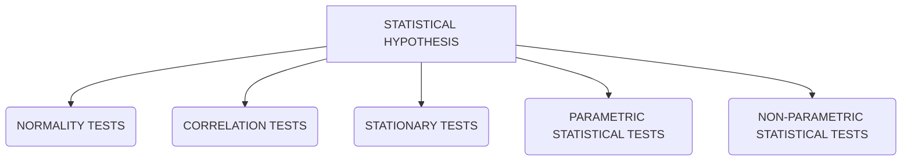

# Statistical-Hypothesis-Testing-with-Python
### Quick-reference guide to the 17 statistical hypothesis tests that you need in applied machine learning, with sample code in Python.

There are 100s types of hypothesis testing existing in field of statistics but we will need the 17 statistical hypothesis testing that we would use in applied machine learning and the machine learning projects.


<br>

## Details about the above named test and their sub branches

<ol>
  <li>NORMALITY TESTS
    
  ```mermaid
  flowchart TD
  A[NORMALITY TESTS] --> B(Shapiro-Wilk Tests)
  A[NORMALITY TESTS] --> C(D'Agostino's K^2 Test)
  A[NORMALITY TESTS] --> D(Anderson-Darling Test)
  ```
    
  <li>CORRELATION TESTS
  <li>STATIONARY TESTS
  <li>PARAMETRIC STATISTICAL HYPOTHESIS TESTS
  <li>NON-PARAMETRIC STATISTICAL HYPOTHESIS TESTS
</ol>
