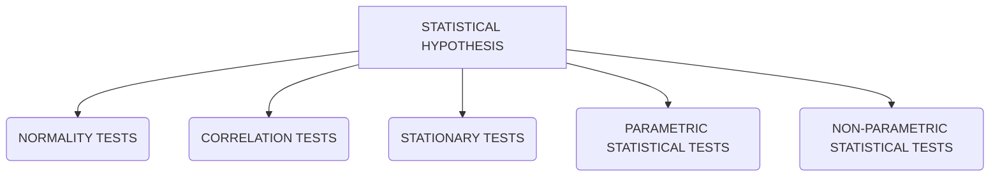

# Statistical-Hypothesis-Testing-with-Python
### Quick-reference guide to the 17 statistical hypothesis tests that you need in applied machine learning, with sample code in Python.
<br>
There are 100s of hypothesis testing types existing in field of statistics but we will need the 17 statistical hypothesis testing that we would use in applied machine learning and the machine learning projects.


<br>

## Details about the above named test and their sub branches

<ol>

  <li>NORMALITY TESTS
    
  ```mermaid
  flowchart TD
  A[NORMALITY TESTS] --> B(Shapiro-Wilk Tests)
  A[NORMALITY TESTS] --> C(D'Agostino's K^2 Test)
  A[NORMALITY TESTS] --> D(Anderson-Darling Test)
  ```
 
 
  <li>CORRELATION TESTS
  
  ```mermaid 
  flowchart TD
  A[CORRELATION TESTS] --> B(Pearson's Correlation Coefficient)
  A[CORRELATION TESTS] --> C(Spearman's Rank Correlation)
  A[CORRELATION TESTS] --> D(Kendall's Rank Correlation)
  A[CORRELATION TESTS] --> E(Chi-Squared Test)
  ```


  <li>STATIONARY TESTS
  
  ```mermaid
  flowchart TD
  A[STATIONARY TESTS] --> B(Augmented Dickey-Fuller)
  A[STATIONARY TESTS] --> C(Kwiatkouski-Phillips-Sehmidt-Shin)
  ```
  

  <li>PARAMETRIC STATISTICAL HYPOTHESIS TESTS
  
  ```mermaid
  flowchart TD
  A[PARAMETRIC STATISTICAL HYPOTHESIS TESTS] --> B(Student's t-test)
  A[PARAMETRIC STATISTICAL HYPOTHESIS TESTS] --> C(Paired Student's t-test)
  A[PARAMETRIC STATISTICAL HYPOTHESIS TESTS] --> D(Analysis of Variance test/ANOVA)
  A[PARAMETRIC STATISTICAL HYPOTHESIS TESTS] --> E(Repeated Measures ANOVA test)
  ```
  
                                                                                          
  <li>NON-PARAMETRIC STATISTICAL HYPOTHESIS TESTS
    
  ```mermaid
  flowchart TD
  A[NON-PARAMETRIC STATISTICAL HYPOTHESIS TESTS] --> B(Mann-Whitney U test)
  A[NON-PARAMETRIC STATISTICAL HYPOTHESIS TESTS] --> C(Wilcoxon Signed-Rank test)
  A[NON-PARAMETRIC STATISTICAL HYPOTHESIS TESTS] --> D(Kruskal-Wallis H Test)
  A[NON-PARAMETRIC STATISTICAL HYPOTHESIS TESTS] --> E(Friedman Test)
  ```
    
</ol>
